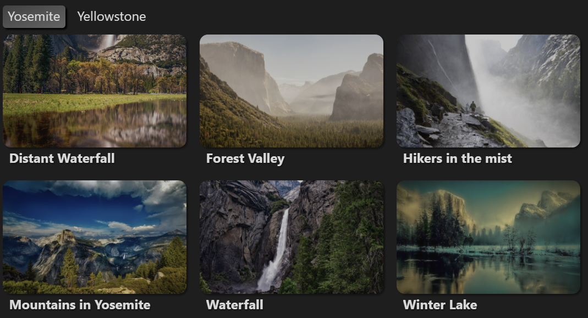

# Obsidian Page Gallery

Generates a gallery view of selected pages based on images found in them.

> **Warning:** This plugin is in development and should be
> considered unstable! Always make a backup of your vault before testing out a new plugin.

## Prereqs

Depends on [obsidian-dataview](https://github.com/blacksmithgu/obsidian-dataview)
to list pages and page metadata.

## Usage

Create a code block with type `page-gallery`:

```page-gallery
from: '"Test Gallery"'
orientation: landscape
columns: 3
fields: [file.name, Description]
```


*Photos from [Unsplash](https://unsplash.com/)*

## Settings

Options in the `page-gallery` block are parsed using YAML.

| Option | Type | Default | Description |
|--------|------|---------|-------------|
|`from`|`string`|-|Query for pages to include in the gallery. Uses the same query syntax as [obsidian-dataview](https://github.com/blacksmithgu/obsidian-dataview).|
|`fields`|`Array<string>`|[]|List of fields to display in the gallery, under the image. Supports both [frontmatter and inline fields](https://blacksmithgu.github.io/obsidian-dataview/data-annotation/).|
|`limit`|`number`|null|Limit on the number of pages that will be displayed in the gallery. Leave this blank to display all of the pages matched by the `from` query.|
|`filter`|`boolean`|true|Whether  or  not to show the filter bar.|
|`columns`|`number`|4|Number of columns to display at full width.|
|`gutterSize`|`string`|`16px`|Size of the gutter between images.|
|`orientation`|`portrait`|`landscape`|`portrait`|Whether to display styles in portrait or landscape mode. This controls the default `width` (see below).|
|`width`|`string`|Calculated from `columns` and `gutterSize`.|Display width of each image in the gallery. Overrides `columns`.|
|`height`|`string`|Calculated from `imageWidth`.|Display height of each image in the gallery.|
|`size`|`string`|`cover`|How the image should be scaled to fit within the gallery tile.|
|`position`|`string`|`center`|Positioning of each image in the gallery. Try `top`, `center`, or `bottom` (etc) to change what parts of the images are visible.|
|`repeat`|`string`|`no-repeat`|Whether to repeat (i.e. tile) the image in each gallery item.|

Additionally, the `size`, `position`, and `repeat` values can be overridden on
a specific page via YAML frontmatter:

```yaml
---
pageGallery:
  size: contain
  position: left
  repeat: repeat-x
---
```
